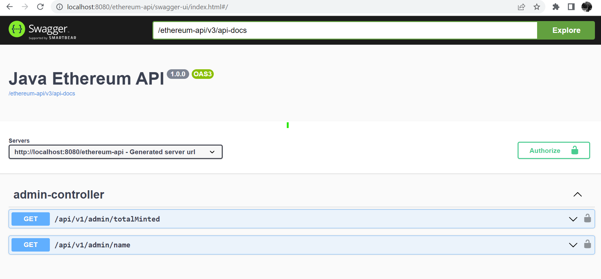

# Java REST API for Interacting with Ethereum Smart Contracts (Hyperledger Besu)

## 🚀 Overview
This project is a Java-based RESTful API designed to interact with smart contracts deployed on an Ethereum-compatible client using **Hyperledger Besu**.

The API enables:
- Retrieving the name of an ERC20 token
- Querying the amount of minted tokens

### 📄 Smart Contract Used
- `UpgradableTokenTest.sol` – a simple upgradable ERC20 token contract

---

## 🛠️ Getting Started

### 1. Clone the Repository
```bash
git clone https://github.com/dariusjvc/Java-RestAPI-For-Ethereum.git
cd java-rest-api-for-evm
```

### 2. Deploy the Smart Contracts
Use Hardhat and the [Quorum Test Network](https://besu.hyperledger.org/en/stable/private-networks/tutorials/quickstart/#prerequisites) to deploy the smart contract.

> **Note:** Make sure you have all prerequisites installed (Node.js, Hardhat, Docker, etc.)

### 3. Run the API
Open the project with **IntelliJ IDEA** or your preferred Java IDE and run the Spring Boot application.

---

## 📷 Screenshot



---

## 🌐 API Access

Once running, access the Swagger UI at:

[http://localhost:8080/ethereum-api/swagger-ui/index.html#/](http://localhost:8080/ethereum-api/swagger-ui/index.html#/)

---

## ✅ Features

- ✅ Java Spring Boot backend
- ✅ Web3j for Ethereum interaction
- ✅ Swagger UI for easy testing
- ✅ Deployable on a local Besu node

---

## 📌 Future Improvements

- Add authentication and security
- Expand smart contract functionality
- Dockerize the application for easier deployment
